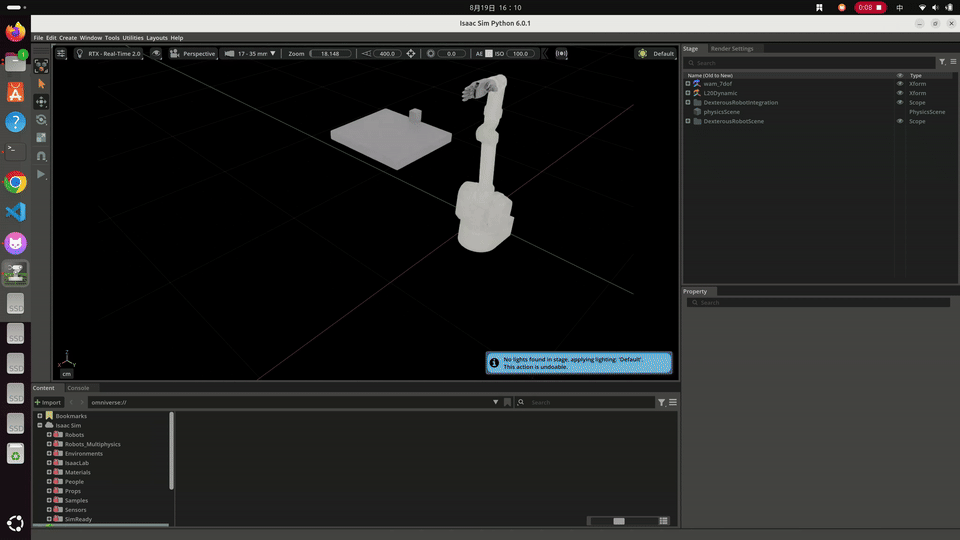

# Dexterous Robot Framework

> 面向**机械臂 + 灵巧手**组合的跨 Backend 机器人操控与实验框架。
> 目标是在尽量保持 Device Model、Controller、Skill、Task 与 Runtime 语义一致的前提下，逐步支持 **Isaac Sim → MuJoCo → Real Robot（Direct / ROS2）**。

---

## 项目状态

当前已经完成第一条真实验证的垂直链路，并完成资产独立化与 Demo 运动节奏优化。

| 模块 / 阶段 | 状态 |
|---|---|
| WAM7 Device Model | ✅ 已完成 |
| Linker Hand L20 Device Model | ✅ 已完成 |
| Robot Composition / `ManipulatorSystem` | ✅ 已完成 |
| Runtime / Backend Contract | ✅ 已完成 |
| Isaac Sim Backend | ✅ 已完成并通过真实 Golden |
| Controller / Skill / Task | ✅ 已完成第一版 |
| Asset Registry / 独立 `robot_assets` | ✅ 已完成 |
| M1.6 Motion Pacing + Higher Lift | ✅ 已完成并冻结 |
| 通用 Motion Profile / 连续轨迹 / Waypoint Blending | 🚧 近期计划 |
| MuJoCo Backend | ⏳ 后续阶段 |
| Real Backend（Direct / ROS2） | ⏳ 后续阶段 |
| Sensors / Tactile | ⏳ 后续阶段 |
| RL / Benchmark | ⏳ 后续阶段 |

当前冻结版本：

```text
m1.6-motion-pacing-height-v1
```

> 当前已验证的 WAM7 + Linker L20 + Isaac Sim 仅是框架的**第一条 Golden vertical slice**，不是框架最终支持范围。

---

## 🎬 效果展示

当前第一条已经通过真实 Golden 验证的 Demo：

### WAM7 + Linker Hand L20 · Isaac Sim Tabletop Grasp & Lift



```text
Approach
→ Grasp
→ GraspLock
→ Lift
→ Hold
```

当前冻结版本：

```text
m1.6-motion-pacing-height-v1
```

关键结果：

| 指标 | 当前结果 |
|---|---:|
| 完整流程 | ≈ 14.93 s |
| Lift command | +80 mm |
| 最大实际抬升 | ≈ 62.49 mm |
| Hold 后最终净抬升 | ≈ 55.17 mm |
| Suspended hold | ≈ 1.01 s |
| Final table normal | 0 N |

> 仓库只保存轻量预览素材，完整高清视频建议作为对应版本的 GitHub Release Asset 保存，避免长期把大型视频写入 Git 历史。

<!--
DEMO_MEDIA_TEMPLATE

当 docs/media/demos/m1_6_wam7_l20_grasp_lift_preview.gif 已加入仓库，
并且 GitHub Release `m1.6-motion-pacing-height-v1` 已上传完整 MP4 后，
将下面这段取消注释，并把 <OWNER>/<REPO> 替换成真实仓库地址：

[](
https://github.com/<OWNER>/<REPO>/releases/download/m1.6-motion-pacing-height-v1/m1_6_wam7_l20_grasp_lift.mp4
)

**点击预览查看完整高清视频。**
-->

后续随着 Backend 与真实机器人能力扩展，这里会逐步形成 Demo Gallery：

```text
Isaac Sim
└── WAM7 + Linker L20 Grasp & Lift        ✅

MuJoCo
└── Same Task / Same Framework            ⏳

Real Robot
└── Same Task / Same Framework            ⏳

Later
├── Different Objects
├── Tactile
├── RL
└── Benchmark
```

媒体文件的命名、尺寸建议与 Release 组织方式见：

```text
docs/media/demos/README.md
```


## 1. 项目目标

Dexterous Robot Framework 不希望成为某一个仿真器、某一台机械臂或某一只灵巧手的专用 Demo。

长期目标是建立一套可扩展的机器人操控框架，使：

- 不同机械臂和灵巧手以独立 **Device Model** 接入；
- Arm 与 Hand 通过 **Robot Composition** 组合；
- Controller 尽量只关心 `state + target + dt -> command`；
- Skill 表达可复用的局部机器人行为；
- Task 负责任务编排、状态转换、失败与恢复策略；
- Runtime 统一 clock、snapshot、command dispatch 与 backend lifecycle；
- Isaac Sim、MuJoCo 与真实机器人共享尽可能多的上层逻辑；
- Robot Assets、Sensors/Tactile、RL、Benchmark 作为横向能力逐步扩展。

最终希望做到：

```text
同一套 Device / Controller / Skill / Task 语义
                    │
                    ▼
              Runtime / Session
                    │
          ┌─────────┼─────────┐
          ▼         ▼         ▼
       Isaac      MuJoCo      Real
                            ┌──┴──┐
                            ▼     ▼
                         Direct  ROS2
```

---

## 2. 整体框架

### 2.1 项目构建路线

```text
Device Model
    ↓
Robot Composition
    ↓
Controller
    ↓
Skill
    ↓
Task
    ↓
Runtime / Session
    ↓
Backend
```

横向能力：

```text
Asset Registry
Sensors / Tactile
RL
Benchmark
```

### 2.2 运行时调用关系

项目构建顺序与运行时调用方向并不完全相同。实际运行中，上层 Task 逐层向下产生动作，并由 Runtime 与 Backend 执行：

```text
Task
 │
 ▼
Skill
 │
 ▼
Controller
 │
 ▼
Typed Command
 │
 ▼
Runtime / Session
 │
 ▼
Backend
 │
 ▼
Simulator / Real Robot
 │
 ▼
Backend State
 │
 ▼
RuntimeSnapshot
```

Task、Skill、Controller 不直接调用 Isaac、MuJoCo、ROS2 或设备 SDK。

---

## 3. 核心设计原则

### Backend-neutral 上层

Core、Task、Skill、Controller 不依赖具体 Backend API。

Backend-specific 逻辑只应向下存在，例如：

```text
src/dexterous_robot/backends/isaac/
src/dexterous_robot/backends/mujoco/      # future
src/dexterous_robot/backends/real/        # future
```

### Typed Command

Controller 不直接驱动仿真器或硬件，而是返回显式 typed command，由 Runtime 统一 dispatch。

### RuntimeSnapshot

Runtime 负责：

- clock / `dt`
- backend lifecycle
- command dispatch
- backend step
- state readback
- snapshot construction
- logging / safety / evidence hooks

Task、Skill、Controller 读取统一的 `RuntimeSnapshot`，而不是依赖任意可变的全局 Blackboard。

### Device-first

Arm 和 Hand 是独立设备。

当前：

```text
Arms
└── WAM7

Hands
└── Linker Hand L20
```

未来可以继续增加 Franka、UR、Allegro、Shadow、Inspire 等设备，而不要求上层框架建立在某一种特定关节数量或协议假设上。

### Robot Composition 不承担任务动作

`ManipulatorSystem` 用于描述：

- Arm + Hand 组合关系
- mount
- frames
- TCP
- joint / device routing
- logical topology

它不提供：

```text
grasp()
lift()
close_hand()
move_ee()
```

这些动作属于 Skill / Controller。

### 设备专有语义局部化

例如 Linker L20 当前固化：

```text
Active16
Protocol20
Physical21

16 leaders + 5 followers
```

这些语义只属于 L20 Device Model，不泄漏到框架 Core。

---

## 4. 当前第一条 Golden Vertical Slice

当前第一个完成真实验证的组合是：

```text
WAM7
  +
Linker Hand L20
  +
Isaac Sim
```

任务：

```text
TabletopGraspLiftTask

Approach
   ↓
Grasp
   ↓
GraspLock
   ↓
Lift
   ↓
Hold
```

公开入口：

```text
examples/isaac/tabletop_grasp_lift.py
```

完整调用链：

```text
TabletopGraspLiftTask
→ Skills
→ Controllers
→ RuntimeSession
→ IsaacBackend
```

### 当前 M1.6 Golden 结果

当前经过真实 Isaac Sim 验证的运动节奏版本：

```text
Approach ≈ 5.21 s
Grasp    ≈ 5.21 s
Lift     ≈ 3.51 s
Hold     ≈ 1.01 s

Total    ≈ 14.93 s
```

当前 Lift command：

```text
+80 mm
```

实际物体表现：

```text
最大实际抬升      ≈ 62.49 mm
Hold 后最终净抬升 ≈ 55.17 mm
Suspended hold    ≈ 1.01 s
Final table normal = 0 N
```

同时：

```text
Tensor = PhysX = USD = Fabric
```

在 Golden transform checkpoints 中保持一致。

> 这些 timing 是**当前稳定 Demo baseline**，不是长期运动控制接口的最终设计。后续会逐步从“分段 duration 参数”演进到更通用的 Motion Profile、速度/加速度/jerk 约束与连续轨迹。

---

## 5. Golden 验收原则

当前 Isaac Golden 至少要求：

- WAM7 + L20 正确加载；
- GraspLock 成功建立；
- 物体离开桌面；
- cuboid center Z 有明确净抬升；
- 完成悬空 Hold；
- table contact 满足离桌要求；
- Tensor / PhysX / USD / Fabric transform 一致；
- runtime / asset 验证过程 fail-closed。

Golden 的作用不仅是展示 Demo，也用于防止后续框架重构、资产迁移或控制修改悄悄破坏已经验证的行为。

---

## 6. Robot Assets 与 Asset Registry

机器人二进制资产、USD、mesh 与 vendor/private geometry **不直接属于本源码仓库**。

项目使用独立、device-first 的 Robot Assets Root：

```text
ROBOT_ASSETS_ROOT
```

典型结构：

```text
robot_assets/
├── arms/
│   └── wam7/
│       └── isaac/
│           └── canonical_geometry_v2/
│
├── hands/
│   └── linker_l20/
│       ├── source/
│       │   └── meshes/
│       └── isaac/
│           └── dynamic_v1/
│
└── manifests/
```

长期原则：

```text
device-first
source / backend separated
project-independent
```

项目源码只使用逻辑 Asset ID，不把本机绝对路径写入 Task / Skill / Controller。

当前 Registry 中的主要逻辑 ID：

```text
arm.wam7.isaac.canonical_geometry_v2
hand.linker_l20.isaac.dynamic_v1
```

Registry：

```text
configs/assets/registry.yaml
```

本地资产根目录配置模板：

```text
configs/assets/robot_assets.example.yaml
```

例如：

```yaml
robot_assets_root: ${ROBOT_ASSETS_ROOT}
```

然后在本地设置：

```bash
export ROBOT_ASSETS_ROOT=/path/to/robot_assets
```

### 为什么资产不直接上传到 GitHub？

正式源码仓库主要跟踪：

- framework source
- config schema / logical asset IDs
- tests
- examples
- docs
- review / verification tools

默认不上传：

- private/vendor robot assets
- 大型 USD / mesh binary
- 本机绝对路径配置
- runtime evidence archives
- experiments
- scratch files
- `.venv`
- run outputs

因此克隆源码仓库并不意味着自动获得私有机器人资产。

---

## 7. 当前项目结构

以下只展示主要结构：

```text
.
├── configs/
│   ├── assets/
│   ├── backends/
│   ├── robots/
│   └── tasks/
│
├── examples/
│   └── isaac/
│
├── src/dexterous_robot/
│   ├── assets/
│   ├── backends/
│   │   └── isaac/
│   ├── config/
│   ├── control/
│   │   ├── arm/
│   │   ├── hand/
│   │   └── math/
│   ├── core/
│   ├── devices/
│   │   ├── arms/
│   │   │   └── wam7/
│   │   └── hands/
│   │       └── linker_l20/
│   ├── golden/
│   ├── robots/
│   ├── runtime/
│   ├── skills/
│   └── tasks/
│
├── tests/
│   ├── contract/
│   ├── golden/
│   ├── integration/
│   └── unit/
│
├── tools/
│   ├── isaac/
│   ├── review/
│   └── run_tests.py
│
├── docs/
│   └── media/
│       └── demos/
├── pyproject.toml
└── README.md
```

---

## 8. 安装与开发测试

项目要求：

```text
Python >= 3.10
```

安装：

```bash
python -m pip install -e '.[dev]'
```

建议通过项目自己的测试入口运行 pytest：

```bash
python tools/run_tests.py -q
```

而不是直接运行：

```bash
pytest
```

原因是机器人开发环境中经常同时存在 ROS、系统 Python 或其他 pytest plugins。项目 runner 会隔离无关的第三方 pytest entry-point，减少环境污染带来的假失败。

---

## 9. Isaac Sim 示例

在已经准备好兼容的 Robot Assets 与 Isaac Sim 环境后，第一条正式示例入口为：

```text
examples/isaac/tabletop_grasp_lift.py
```

该示例负责构造：

```text
WAM7 + Linker L20 ManipulatorSystem
        ↓
IsaacBackend
        ↓
RuntimeSession
        ↓
TabletopGraspLiftTask
```

并记录 Golden 所需的任务、接触、位姿与 transform consistency 证据。

由于 Isaac Sim、USD 资产与本地运行环境具有较强环境依赖，具体 runtime setup 会继续通过 config、Asset Registry 与项目文档逐步标准化，而不是在业务代码中硬编码本机路径。

---

## 10. 项目执行路线

当前总体路线：

```text
M1
Isaac 第一条完整 Vertical Slice
        ✅

M1.5
Asset Independence
+ device-first robot_assets
+ Asset Registry
        ✅

M1.6
Demo Motion Pacing
+ Higher Lift
        ✅

近期
Motion Control Generalization
+ Motion Profile
+ velocity / acceleration / jerk constraints
+ waypoint blending
+ continuous trajectory
        🚧

M2
MuJoCo Backend
        ⏳

M3
Real Backend
├── Direct SDK / CAN / native API
└── ROS2 Adapter
        ⏳

后续横向扩展
Sensors / Tactile
Tactile Controller
RL Policy Adapter
Benchmark
Multi-arm / Multi-hand
        ⏳
```

M2 不会重新实现一套独立 Task，而是尽量复用已经存在的：

```text
Device Model
Robot Composition
Controller
Skill
Task
Runtime Contract
Asset Registry
```

仅新增 MuJoCo-specific Backend、model/topology mapping 与必要的 backend adapter。

---

## 11. 项目演进记录

README 首页只保留阶段级别的演进信息。具体实验、失败尝试、sealed evidence 与研究性历史不作为公共 API 文档。

<details>
<summary><b>展开查看：从项目建立到当前版本的实现路线</b></summary>

### 起点：从 Research Prototype 中抽离正式框架

项目最初已有一套能够在 Isaac Sim 中运行 WAM7 + Linker L20 抓取/举升实验的 research implementation。

新的 Dexterous Robot Framework 没有继续扩展旧实验脚本，而是将旧项目冻结为：

```text
Research Legacy
Evidence Authority
Golden Reference
```

随后以已经验证过的真实行为作为 oracle，重新建立干净的跨 Backend framework。

---

### M1-R0 ~ M1-R4：建立框架骨架

完成：

- Project Bootstrap；
- Core / typed config；
- Linker L20 Device Model；
- Active16 / Protocol20 / Physical21 contracts；
- Runtime / Backend Contract；
- WAM7 Device Model；
- `ManipulatorSystem` Robot Composition。

这一阶段重点是建立清晰的模块边界，而不是追求 Demo 数量。

---

### M1-R5 ~ M1-R7：建立 Isaac Vertical Slice

完成：

- Isaac Backend；
- articulation / topology / joint-name routing；
- transform synchronization；
- contact normalization；
- WAM kinematics；
- minimum-jerk trajectory；
- `GraspLockController`；
- `CartesianCarryController`；
- Approach / Grasp / Lift / Hold Skills；
- `TabletopGraspLiftTask`。

上层 Task / Skill / Controller 保持不直接依赖 Isaac API。

---

### M1-R8：真实 Isaac Golden

第一次在新框架中完整复现：

```text
Approach
→ Grasp
→ GraspLock
→ Lift
→ Hold
→ SUCCESS
```

并建立正式 Golden Acceptance。

冻结 tag：

```text
m1-isaac-wam7-l20-grasp-lift
```

从这一阶段开始，旧 research project 不再承担正式开发主线。

---

### M1.5：Asset Independence

将已经验证成功的 WAM7 / Linker L20 runtime assets 从旧研究目录和本机历史绝对路径中迁出。

完成：

- 44-file dependency closure audit；
- device-first `robot_assets`；
- source / backend-specific asset 分离；
- WAM USD legacy path rewrite / provenance cleanup；
- OpenUSD dependency revalidation；
- Asset Registry；
- Golden 使用 Asset Registry 重新验证；
- source assets 与 migrated assets 前后 hash authority。

冻结 tag：

```text
m1.5-robot-assets-v1
```

至此正式 framework runtime 不再依赖旧 research project 目录作为资产位置。

---

### M1.6：Motion Pacing + Higher Lift

在不改变抓取几何和核心 GraspLock 逻辑的前提下，优化 Demo 节奏：

- 缩短 Approach；
- 缩短 Grasp preload / lock ramp；
- 将 Lift 从极保守的慢速版本提升到更自然的执行速度；
- commanded lift 提高到 80 mm；
- 重新执行真实 Isaac Golden；
- 保持悬空、离桌与 transform consistency。

当前冻结 tag：

```text
m1.6-motion-pacing-height-v1
```

这一阶段同时暴露出下一项需要解决的问题：

> 当前 Demo 仍较依赖分段 waypoint 与显式 duration 参数。长期应该将运动节奏抽象为可复用 Motion Profile，并进一步支持连续轨迹与 waypoint blending。

</details>

---

## 12. 开发边界

正式生产代码与正式测试进入 Git。

以下内容默认保持在源码仓库之外或通过 `.gitignore` 隔离：

```text
configs/local/
experiments/
runs/
evidence/
scratch/
private robot assets
local absolute-path configuration
```

项目不通过复制旧实验 runner 来扩展新功能。

对于新的 Backend、Device 或 Task，优先遵循已有的层级边界和 contract tests。

---

## 13. 近期计划

在进入大规模多 Backend 扩展之前，当前近期优先方向是进一步整理运动控制层：

```text
当前：
waypoint
→ minimum-jerk segment
→ stop
→ next segment

目标：
semantic motion goal
→ Motion Profile
→ velocity / acceleration / jerk limits
→ waypoint blending / continuous trajectory
→ Controller
```

希望逐步减少：

```text
每增加一个 Task
→ 增加大量 task-specific duration 参数
```

并转向：

```text
Task / Skill 描述“做什么”
Motion Profile 描述“如何运动”
Controller 描述“如何跟踪”
Backend 描述“如何执行”
```

完成这一层整理后，再继续推进 MuJoCo Backend、真实机器人、触觉与更高级任务。

---

## 14. 文档

架构设计、实现计划与阶段性 review 文档位于：

```text
docs/
```

其中部分早期设计与 implementation plan 保存在：

```text
docs/superpowers/
```

README 只描述当前公共框架、使用方式、总体路线与阶段级演进，不替代详细设计文档和测试证据。
